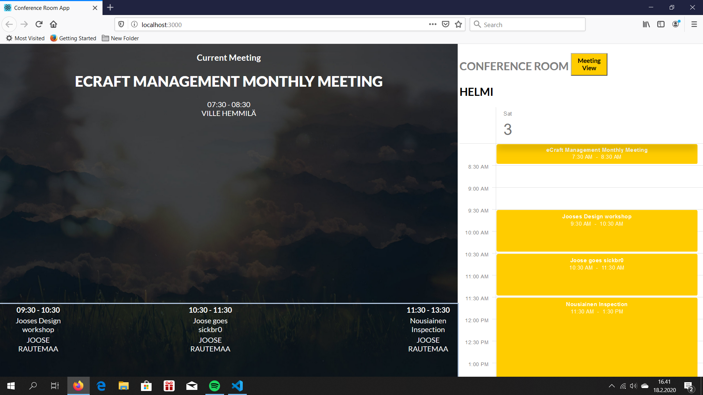
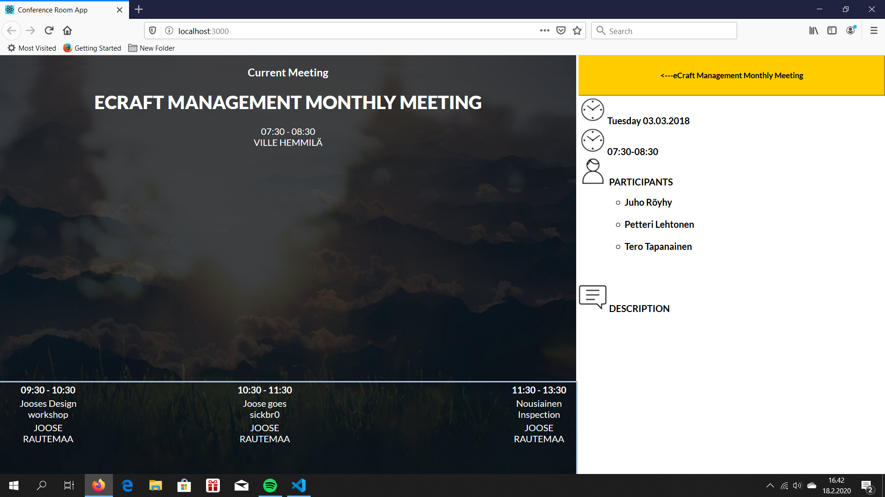

This project was done using npx create-react-app command.
If you wish to demo this please download the files and go to the root of the project directory and use the command 'npm install'.
After that use 'npm start'. Demo can then be found in localhost:3000.

Some of the information is 'hard-coded'. Meaning that if information would be added to 'meetings.json' file then only the calendar itself would actually update with the new information. All of the other information is fetched from the json but with indexing.

This is the calendar view of the app:

And this is the opened meeting view:

