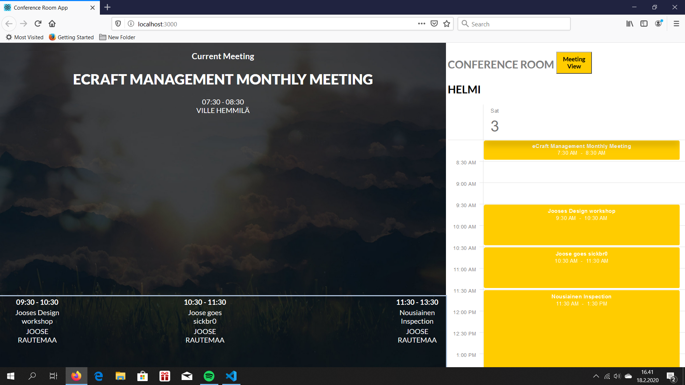

This project was done using npx create-react-app command.
If you wish to demo this please download the files and go to the root of the project directory and use the command 'npm install'.
After that use 'npm start'. Demo can then be found in localhost:3000.

This is the calnder view of the app:

