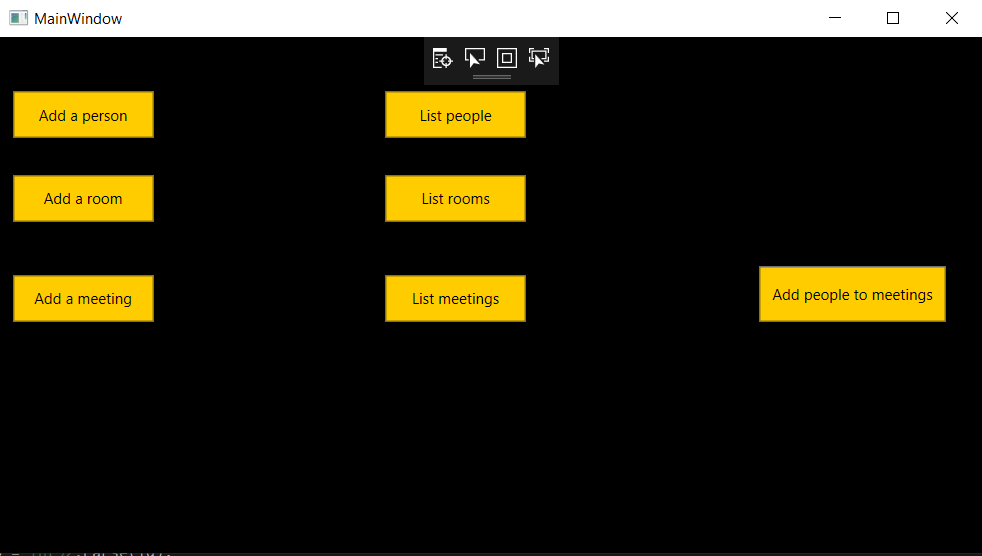
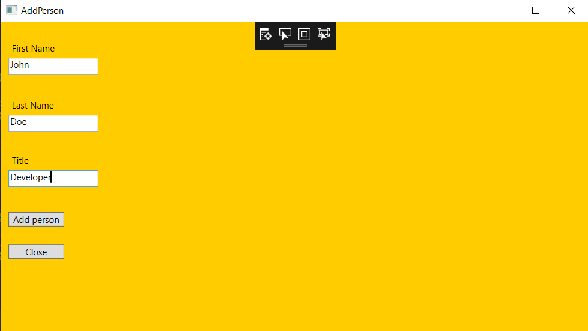
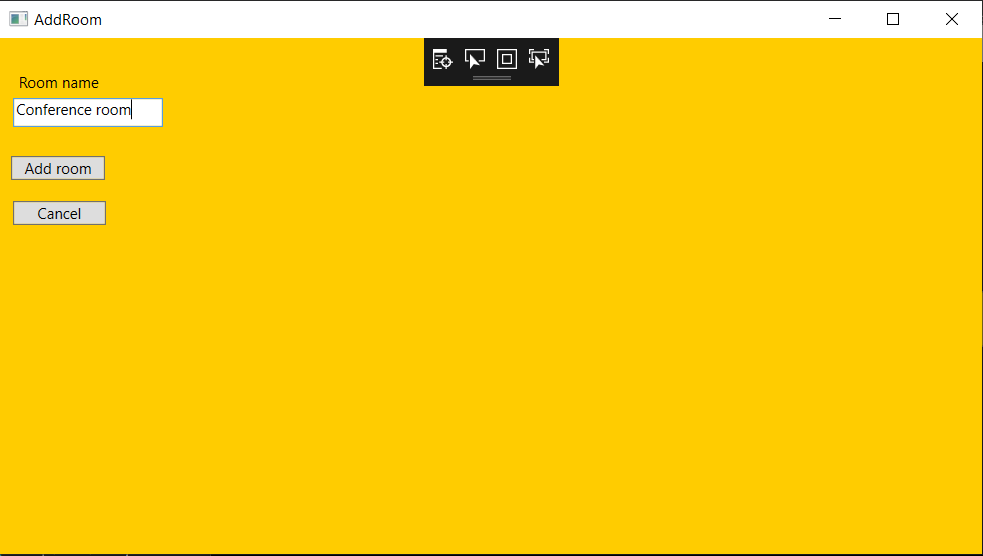
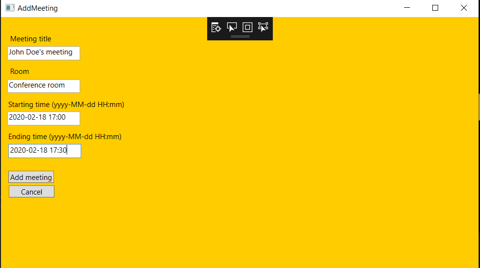
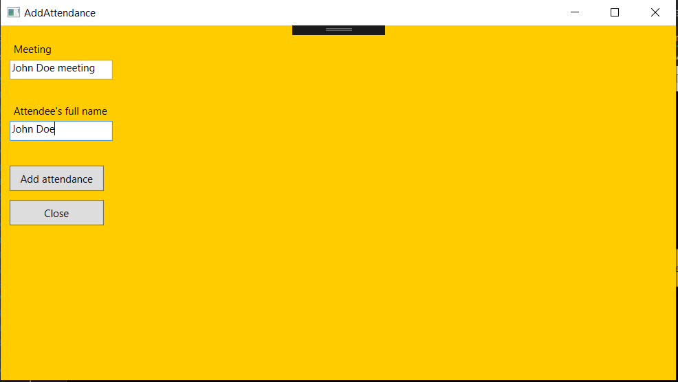
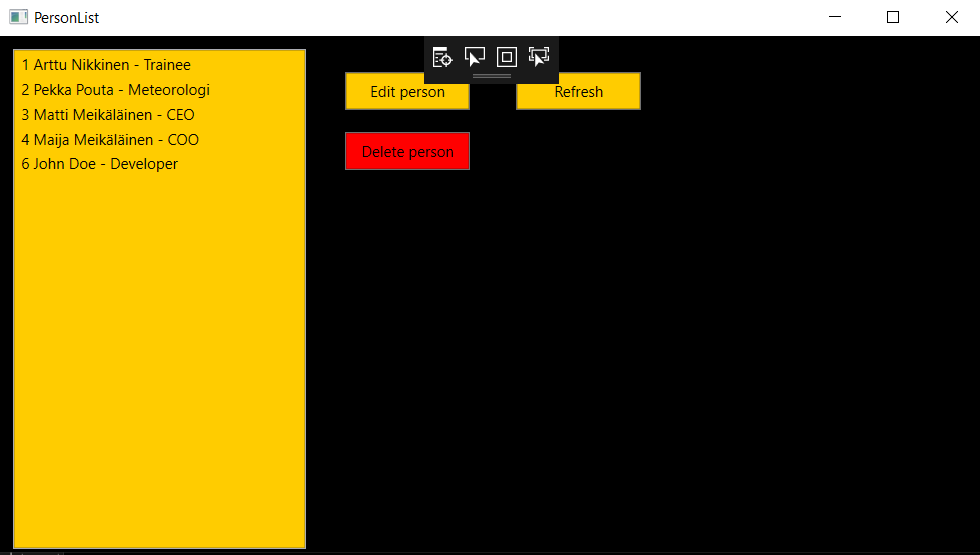
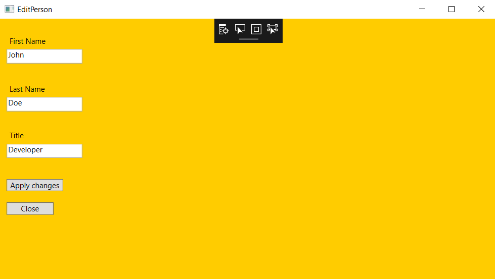
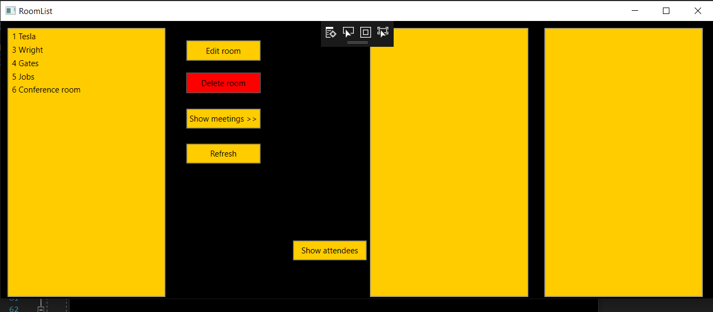
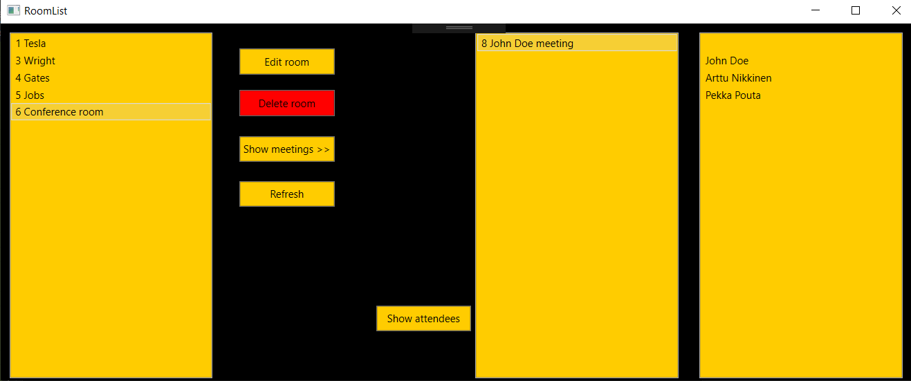
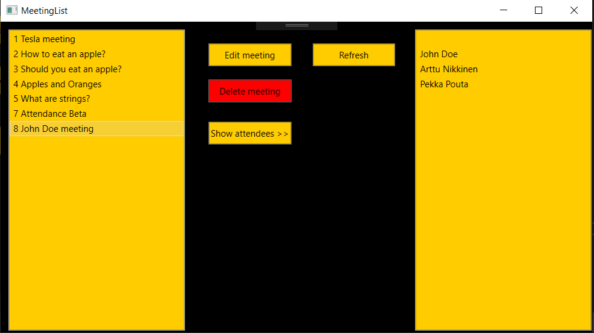

# ecraft-tasks/Backend
Tasks given by Ecraft for backend.
The task was to create backend for creating/updating/deleting rooms, people and meetings.
The app can also list all items.

This project was done using Visual Studio 2017 and WPF app using .NET Framework.
Database used is MySql using XAMPP and localhost phpmyadmin services.

This is the main menu view:

This view is for adding people:

This view is for adding a room:

This view is for adding a meeting:

This view is for adding participants to the meetings:

This view is for listing all of the people:

By selecting 'delete' the user can delete selected person from the list.

This view is for editing a person:

All of the editing works. Each time user edits person, room or meeting they will go to a view similar to adding these items.
In these editing views all of the fields are already filled out. The user can just edit the fields they wish.

This view is for listing rooms:

Here the user can edit or delete rooms. Also they are given a choice to see all of the meetings taking place in selected room and seeing all the participants to selected meeting. Example below:

This view is for listing meetings and participants to those meetings:

